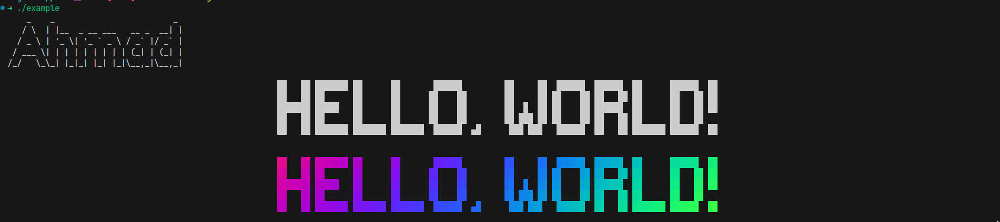

# Use Figlet in C++

### Dependencies

-   **figlet** package

### Example

```cpp
#include "./figlet.h"

int main() {
    ahm::figlet my_figlet1("Ahmad"); // print with the default figlet font

    ahm::figlet my_figlet2;
    std::vector<std::string> flags = { "-t", "-c" };
    my_figlet2.flags(flags); // my_figlet2.flags({"-t", "-c"});
    // my_figlet2.flags({ "-f ~/.local/share/fonts/future.flf" }); // you can specify the font with .flags() but .font_path() is more simple
    my_figlet2.font_path("~/.local/share/fonts/future.flf");
    my_figlet2.text("Hello, world!");
    my_figlet2.execute();
    my_figlet2.lolcat(); // requires lolcat package

    return 0;
}
```
output:

